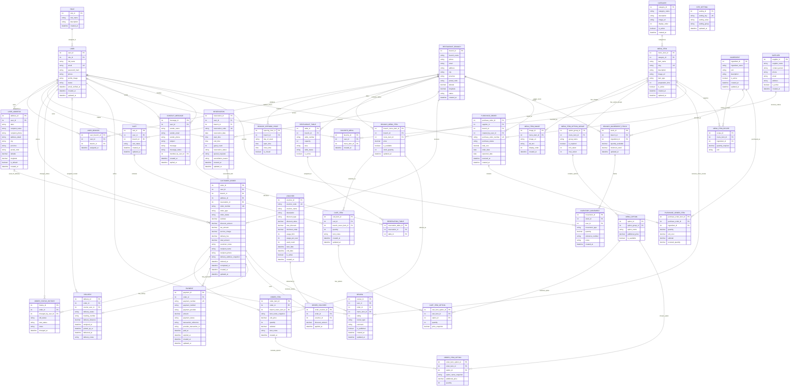

# ERD Website Restoran

```mermaid
erDiagram

    ROLE {
        int role_id PK
        string role_name
        string description
        datetime created_at
    }

    USER {
        int user_id PK
        int role_id FK
        string full_name
        string email UK
        string password_hash
        string phone
        string profile_image
        string status
        datetime email_verified_at
        datetime created_at
        datetime updated_at
    }

    USER_BRANCH {
        int user_branch_id PK
        int user_id FK
        int branch_id FK
        datetime assigned_at
    }

    USER_ADDRESS {
        int address_id PK
        int user_id FK
        string label
        string recipient_name
        string recipient_phone
        string address_detail
        string city
        string province
        string postal_code
        decimal latitude
        decimal longitude
        boolean is_default
        datetime created_at
    }

    RESTAURANT_BRANCH {
        int branch_id PK
        string branch_name
        string phone
        string email
        string address
        string city
        string province
        string postal_code
        decimal latitude
        decimal longitude
        string status
        datetime created_at
    }

    BRANCH_OPENING_HOUR {
        int opening_hour_id PK
        int branch_id FK
        string day_of_week
        time open_time
        time close_time
        boolean is_closed
    }

    CATEGORY {
        int category_id PK
        string category_name
        string description
        string image_url
        int display_order
        boolean is_active
        datetime created_at
    }

    MENU_ITEM {
        int menu_item_id PK
        int category_id FK
        string item_name
        string slug UK
        string description
        string image_url
        string item_type
        int preparation_time
        boolean is_active
        datetime created_at
        datetime updated_at
    }

    MENU_ITEM_IMAGE {
        int image_id PK
        int menu_item_id FK
        string image_url
        string alt_text
        int display_order
        datetime created_at
    }

    BRANCH_MENU_ITEM {
        int branch_menu_item_id PK
        int branch_id FK
        int menu_item_id FK
        decimal price
        boolean is_available
        int stock_quantity
        datetime updated_at
    }

    MENU_ITEM_OPTION_GROUP {
        int option_group_id PK
        int menu_item_id FK
        string group_name
        boolean is_required
        int min_select
        int max_select
    }

    MENU_OPTION {
        int option_id PK
        int option_group_id FK
        string option_name
        decimal additional_price
        boolean is_available
    }

    CART {
        int cart_id PK
        int user_id FK
        int branch_id FK
        string cart_status
        datetime created_at
        datetime updated_at
    }

    CART_ITEM {
        int cart_item_id PK
        int cart_id FK
        int branch_menu_item_id FK
        int quantity
        string item_notes
        datetime created_at
        datetime updated_at
    }

    CART_ITEM_OPTION {
        int cart_item_option_id PK
        int cart_item_id FK
        int option_id FK
        int quantity
        decimal price_snapshot
    }

    RESTAURANT_TABLE {
        int table_id PK
        int branch_id FK
        string table_number
        int capacity
        string area
        string table_status
        boolean is_active
    }

    RESERVATION {
        int reservation_id PK
        int user_id FK
        int branch_id FK
        string reservation_code UK
        date reservation_date
        time start_time
        time end_time
        int guest_count
        string reservation_status
        string special_requests
        string cancellation_reason
        datetime created_at
        datetime updated_at
    }

    RESERVATION_TABLE {
        int reservation_table_id PK
        int reservation_id FK
        int table_id FK
    }

    CUSTOMER_ORDER {
        int order_id PK
        int user_id FK
        int branch_id FK
        int address_id FK
        int reservation_id FK
        string order_number UK
        string order_type
        string order_status
        decimal subtotal
        decimal discount_amount
        decimal tax_amount
        decimal service_charge
        decimal delivery_fee
        decimal total_amount
        string customer_notes
        string recipient_name
        string recipient_phone
        string delivery_address_snapshot
        datetime ordered_at
        datetime completed_at
        datetime created_at
        datetime updated_at
    }

    ORDER_ITEM {
        int order_item_id PK
        int order_id FK
        int branch_menu_item_id FK
        string item_name_snapshot
        decimal unit_price
        int quantity
        decimal subtotal
        string item_notes
        datetime created_at
    }

    ORDER_ITEM_OPTION {
        int order_item_option_id PK
        int order_item_id FK
        int option_id FK
        string option_name_snapshot
        decimal additional_price
        int quantity
    }

    ORDER_STATUS_HISTORY {
        int history_id PK
        int order_id FK
        int changed_by_user_id FK
        string old_status
        string new_status
        string notes
        datetime changed_at
    }

    PAYMENT {
        int payment_id PK
        int order_id FK
        string payment_number UK
        string payment_method
        string payment_provider
        decimal amount
        string payment_status
        string transaction_reference
        string provider_transaction_id
        datetime paid_at
        datetime expired_at
        datetime created_at
        datetime updated_at
    }

    DELIVERY {
        int delivery_id PK
        int order_id FK
        int courier_user_id FK
        string delivery_status
        string tracking_number
        decimal delivery_distance
        datetime assigned_at
        datetime picked_up_at
        datetime delivered_at
        string delivery_notes
    }

    VOUCHER {
        int voucher_id PK
        string voucher_code UK
        string voucher_name
        string description
        string discount_type
        decimal discount_value
        decimal max_discount
        decimal minimum_order
        int usage_limit
        int usage_per_user
        int used_count
        datetime start_date
        datetime end_date
        boolean is_active
        datetime created_at
    }

    ORDER_VOUCHER {
        int order_voucher_id PK
        int order_id FK
        int voucher_id FK
        decimal discount_amount
        datetime applied_at
    }

    REVIEW {
        int review_id PK
        int user_id FK
        int order_id FK
        int menu_item_id FK
        int rating
        string review_type
        string comment
        boolean is_published
        datetime created_at
        datetime updated_at
    }

    FAVORITE_MENU {
        int favorite_id PK
        int user_id FK
        int menu_item_id FK
        datetime created_at
    }

    CONTACT_MESSAGE {
        int message_id PK
        int user_id FK
        string sender_name
        string sender_email
        string sender_phone
        string subject
        string message
        string message_status
        int handled_by_user_id FK
        datetime created_at
        datetime replied_at
    }

    INGREDIENT {
        int ingredient_id PK
        string ingredient_name
        string unit
        string description
        boolean is_active
        datetime created_at
        datetime updated_at
    }

    MENU_ITEM_RECIPE {
        int recipe_id PK
        int menu_item_id FK
        int ingredient_id FK
        decimal quantity_required
        string unit
    }

    BRANCH_INGREDIENT_STOCK {
        int stock_id PK
        int branch_id FK
        int ingredient_id FK
        decimal quantity_available
        decimal minimum_stock
        datetime updated_at
    }

    INVENTORY_MOVEMENT {
        int movement_id PK
        int stock_id FK
        int user_id FK
        string movement_type
        decimal quantity
        string reference_number
        string notes
        datetime created_at
    }

    SUPPLIER {
        int supplier_id PK
        string supplier_name
        string contact_person
        string phone
        string email
        string address
        boolean is_active
        datetime created_at
    }

    PURCHASE_ORDER {
        int purchase_order_id PK
        int supplier_id FK
        int branch_id FK
        int created_by_user_id FK
        string purchase_order_number UK
        string purchase_status
        decimal total_cost
        date order_date
        date expected_date
        datetime received_at
        datetime created_at
    }

    PURCHASE_ORDER_ITEM {
        int purchase_order_item_id PK
        int purchase_order_id FK
        int ingredient_id FK
        decimal quantity
        decimal unit_cost
        decimal subtotal
        decimal received_quantity
    }

    SITE_SETTING {
        int setting_id PK
        string setting_key UK
        string setting_value
        string setting_group
        datetime updated_at
    }

    ROLE ||--o{ USER : assigned_to
    USER ||--o{ USER_BRANCH : assigned_to
    RESTAURANT_BRANCH ||--o{ USER_BRANCH : employs

    USER ||--o{ USER_ADDRESS : owns
    RESTAURANT_BRANCH ||--o{ BRANCH_OPENING_HOUR : defines_hours

    CATEGORY ||--o{ MENU_ITEM : categorizes
    MENU_ITEM ||--o{ MENU_ITEM_IMAGE : has_images
    RESTAURANT_BRANCH ||--o{ BRANCH_MENU_ITEM : offers
    MENU_ITEM ||--o{ BRANCH_MENU_ITEM : listed_as

    MENU_ITEM ||--o{ MENU_ITEM_OPTION_GROUP : has_option_groups
    MENU_ITEM_OPTION_GROUP ||--o{ MENU_OPTION : contains_options

    USER ||--o{ CART : owns
    RESTAURANT_BRANCH ||--o{ CART : serves
    CART ||--o{ CART_ITEM : contains
    BRANCH_MENU_ITEM ||--o{ CART_ITEM : selected_as
    CART_ITEM ||--o{ CART_ITEM_OPTION : has_options
    MENU_OPTION ||--o{ CART_ITEM_OPTION : selected_option

    RESTAURANT_BRANCH ||--o{ RESTAURANT_TABLE : contains_tables
    USER ||--o{ RESERVATION : makes
    RESTAURANT_BRANCH ||--o{ RESERVATION : receives
    RESERVATION ||--o{ RESERVATION_TABLE : allocates
    RESTAURANT_TABLE ||--o{ RESERVATION_TABLE : assigned_to

    USER ||--o{ CUSTOMER_ORDER : places
    RESTAURANT_BRANCH ||--o{ CUSTOMER_ORDER : receives
    USER_ADDRESS o|--o{ CUSTOMER_ORDER : used_for_delivery
    RESERVATION o|--o{ CUSTOMER_ORDER : associated_with

    CUSTOMER_ORDER ||--|{ ORDER_ITEM : contains
    BRANCH_MENU_ITEM ||--o{ ORDER_ITEM : ordered_as
    ORDER_ITEM ||--o{ ORDER_ITEM_OPTION : includes_options
    MENU_OPTION ||--o{ ORDER_ITEM_OPTION : chosen_option

    CUSTOMER_ORDER ||--o{ ORDER_STATUS_HISTORY : has_history
    USER o|--o{ ORDER_STATUS_HISTORY : changes_status

    CUSTOMER_ORDER ||--o{ PAYMENT : has_payments
    CUSTOMER_ORDER ||--o| DELIVERY : has_delivery
    USER o|--o{ DELIVERY : assigned_courier

    CUSTOMER_ORDER ||--o{ ORDER_VOUCHER : uses
    VOUCHER ||--o{ ORDER_VOUCHER : redeemed_in

    USER ||--o{ REVIEW : writes
    CUSTOMER_ORDER ||--o{ REVIEW : receives_review
    MENU_ITEM o|--o{ REVIEW : receives_menu_review

    USER ||--o{ FAVORITE_MENU : saves
    MENU_ITEM ||--o{ FAVORITE_MENU : favorited_by

    USER o|--o{ CONTACT_MESSAGE : sends
    USER o|--o{ CONTACT_MESSAGE : handles

    MENU_ITEM ||--o{ MENU_ITEM_RECIPE : requires
    INGREDIENT ||--o{ MENU_ITEM_RECIPE : used_in_recipe

    RESTAURANT_BRANCH ||--o{ BRANCH_INGREDIENT_STOCK : stores
    INGREDIENT ||--o{ BRANCH_INGREDIENT_STOCK : stocked_as
    BRANCH_INGREDIENT_STOCK ||--o{ INVENTORY_MOVEMENT : tracks
    USER ||--o{ INVENTORY_MOVEMENT : records

    SUPPLIER ||--o{ PURCHASE_ORDER : receives_orders
    RESTAURANT_BRANCH ||--o{ PURCHASE_ORDER : orders_stock
    USER ||--o{ PURCHASE_ORDER : creates
    PURCHASE_ORDER ||--|{ PURCHASE_ORDER_ITEM : contains
    INGREDIENT ||--o{ PURCHASE_ORDER_ITEM : purchased_as
```
